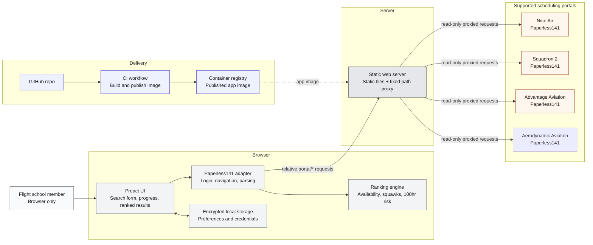

# Plane Finder Architecture

Plane Finder has no application backend. The browser performs the read-only
workflow and ranking logic, while nginx only serves static assets and forwards
fixed portal paths.
